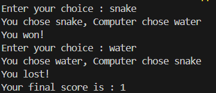

# 🐍 Snake Water Gun Game 🎮

A fun twist on the classic **Rock Paper Scissors**, this command-line Python game lets you play **Snake 🐍, Water 💧, and Gun 🔫** against the computer! Simple, entertaining, and a great beginner-friendly Python project.

---

## ✨ Features

- 🎲 Random computer moves
- 🧠 Intelligent win/loss logic
- 🔁 Multiple rounds support
- 🧮 Score tracking

---

## 🔧 Game Rules

- **Snake** drinks the **Water** → Snake wins ✅  
- **Water** douses the **Gun** → Water wins ✅  
- **Gun** kills the **Snake** → Gun wins ✅  
- Same choices → It's a draw 🤝

---

## 📷 Screenshot

  

---

## ▶️ How to Play

1. **Clone the repository**:
   ```bash
   git clone https://github.com/your-username/snake-water-gun.git
   cd snake-water-gun
2. **Run the game:**:
   ```bash
   python game.py
3. **Follow the on-screen instructions and have fun!**:

---

## 🧠 Technologies Used

- Python 3.x

- Random module

---

## 💡 Future Improvements

- GUI version using Tkinter or PyGame

- Score history/log file

- Multiplayer support

---

## 📄 License

This project is licensed under the MIT License.

---

## 🙌 Acknowledgements

Inspired by the classic game "Rock Paper Scissors" and adapted with a creative twist for Python practice.

---

# Made with ❤️ by Rachit Khowal

